# 40EWR-L und MarCator Verschiedene Anforedrungsraten:

## 40EWR-L:
- Requesttakt: 2000ms
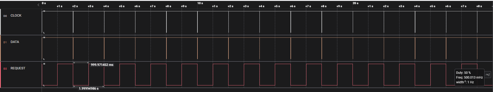
- Requesttakt: 1200ms
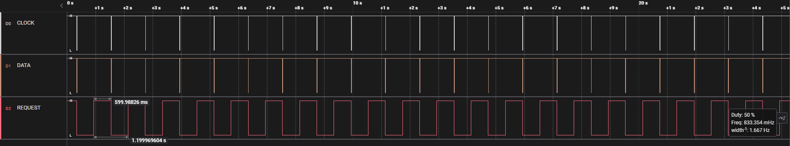
- Requesttakt: 1100ms
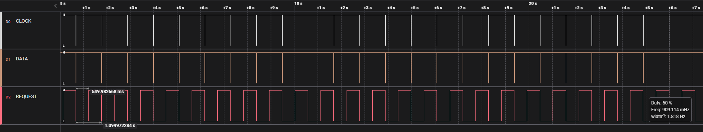
- Requesttakt: 1000ms
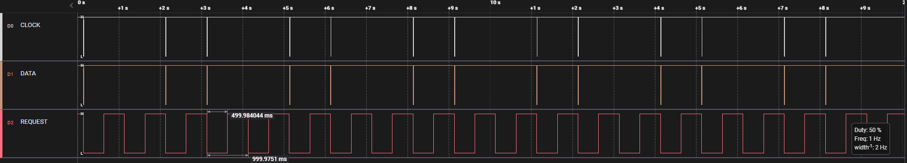
- Requesttakt: 900ms
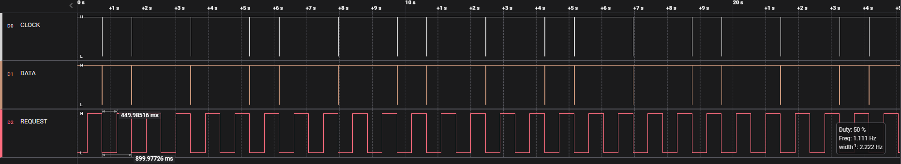
- Requesttakt: 800ms
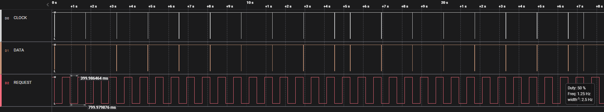
- Requesttakt: 700ms
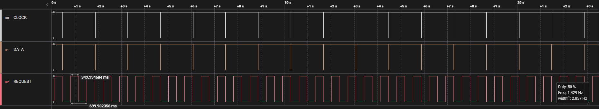
- Requesttakt: 600ms
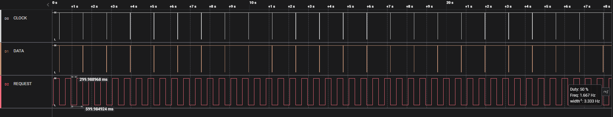
- Requesttakt: 500ms
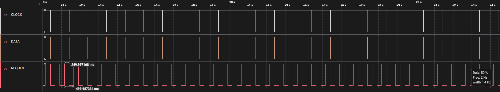
- Requesttakt: 250ms
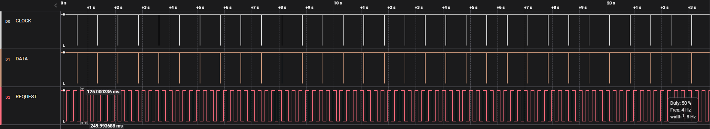
- Requesttakt: 250ms Zoom
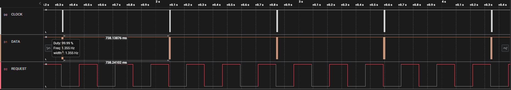
- Requesttakt: 150ms
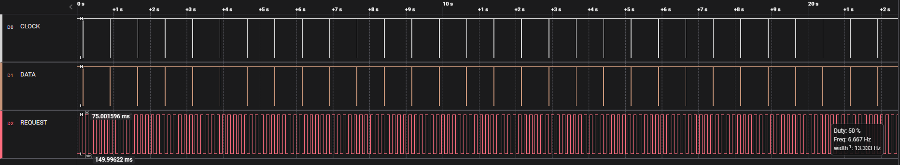
- Requesttakt: 150ms Zoom
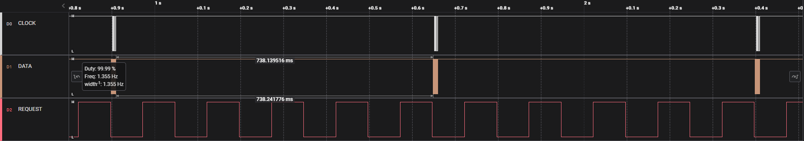
- Requesttakt: 100ms
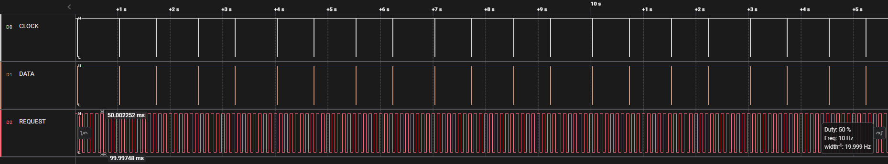
- Requesttakt: 100ms Zoom
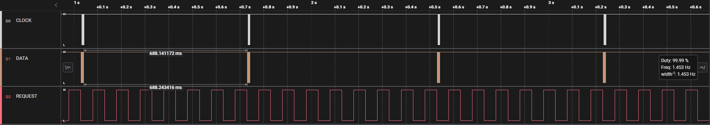

## MarCator:
- Requesttakt: 100ms
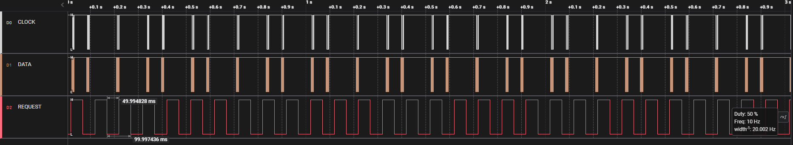
- Requesttakt: 80ms
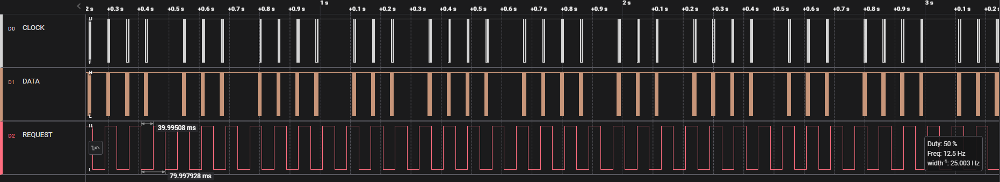
- Requesttakt: 80ms Zoom
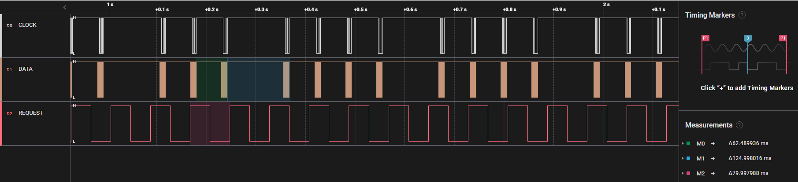

## Zusammenfassung:
- 40EWR-L erst bei 1200ms stabil
- 40EWR-L, wenn Anforderungsrate ist schneller ( <250ms) antwort stabilisiert sich ca 700ms jede Antwort
- MarCator Antwort Zeit kann ca 60ms sein aber <80ms Anforderungszeit ist nicht Stabil.