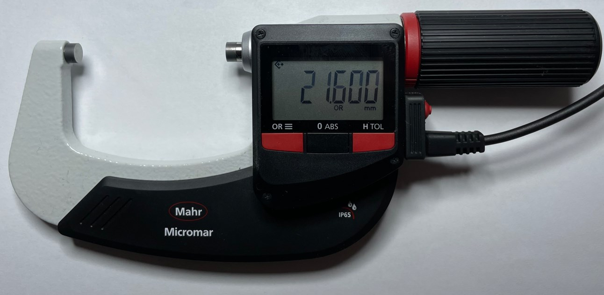
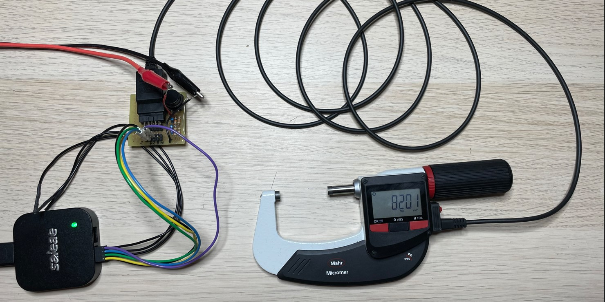
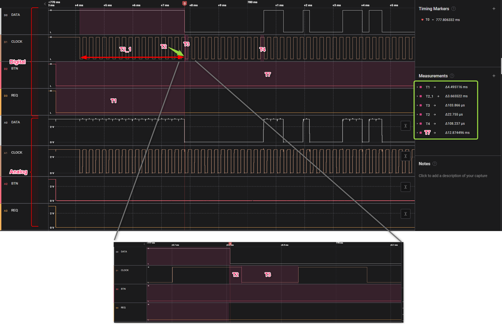
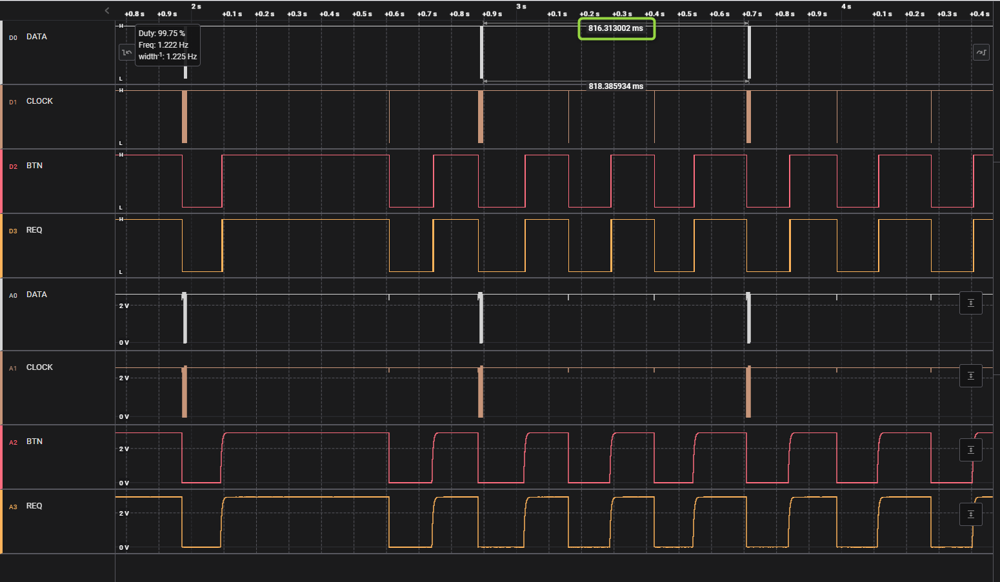
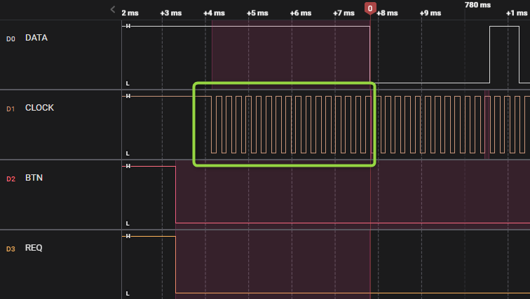
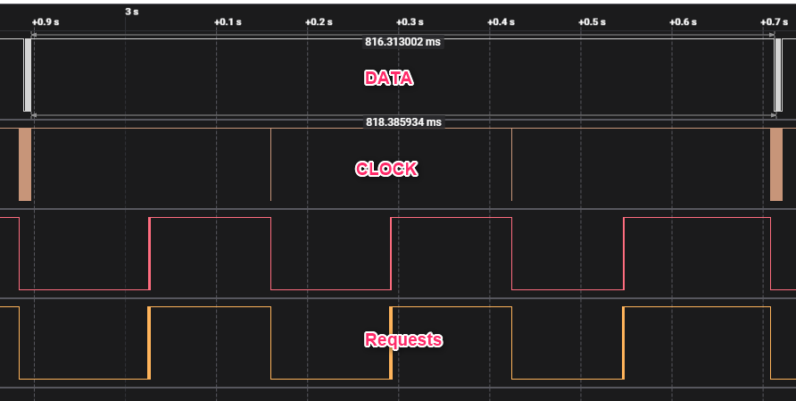
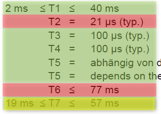

# 40EWR-L digimatic schnittstelle pruefung

## 1. Messaufbau:
### 1.1. 40EWR-L (art.: 4157021, sn.: 22100002)
### 1.2. Digimatic Kabel: DK-D1
### 1.3. Messung/Empfänger: Saleae logic Pro 8
### 1.4. Signalkonditionierung: 3VDC an DATA, CLOCK und REQUEST

  
## 2. Interface Beschreibung
***(Datenblatt: Ba_3723295_DK-U-D_de_en_fr_es_it_zh_0322-1.pdf):***

                      
## 3. Messungen:
### 3.1. Zeitaufnahme:

### 3.1. Zeitaufnahme mit Multi-Anforderung:

  
## 4. Ergebnis:
Zeiten in Bezug zum Datenblatt sind in Normen außer 2 (3) punkten:
### 4.1. CLOCK-signal startet bevor DATA (T2_1 ist -3,66 ms)

### 4.2. Wenn REQUEST ist schneller als ca. 816 ms wird keine Datei geschickt (T6).

### 4.3. T7 ist bisschenkurz aber kleine abweichung.  
