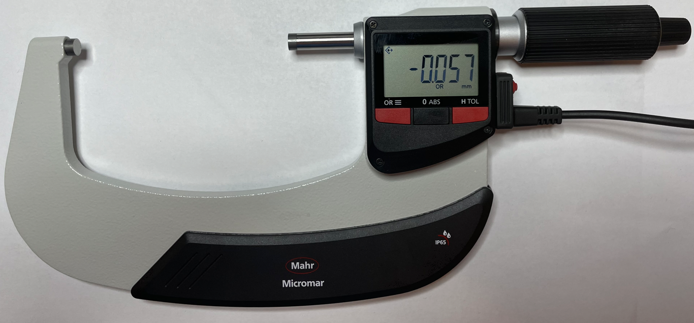
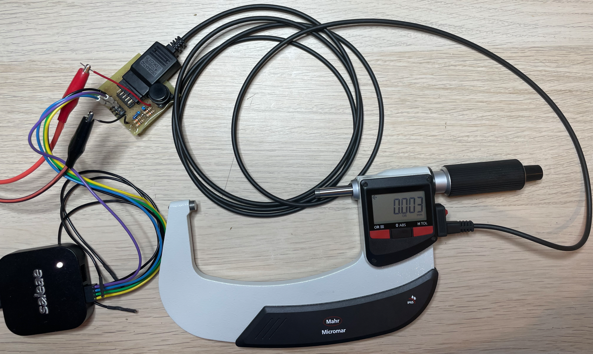
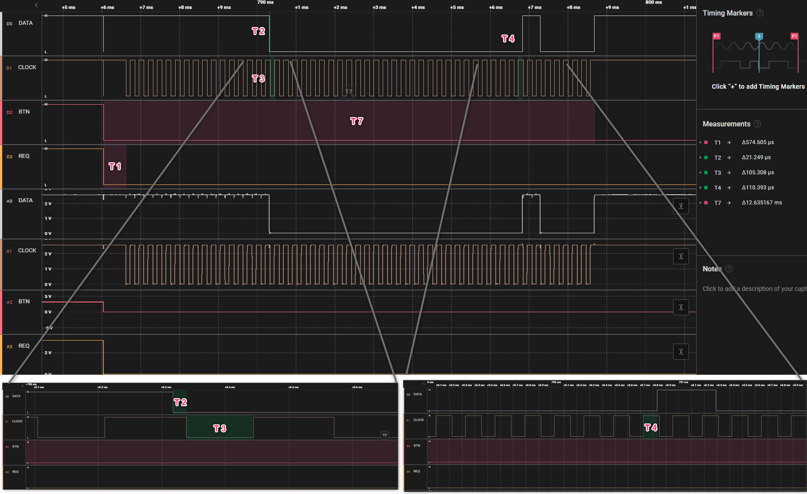
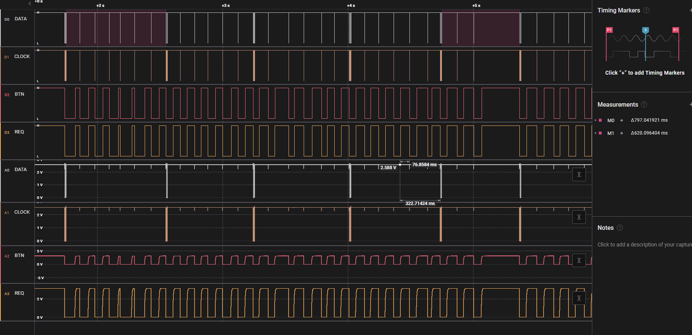

# Micromar digimatic schnittstelle pruefung

## 1. Messaufbau:
### 1.1. 40EWR, 75-100mm (art.: 4157003, kein Seriennummer)
### 1.2. Digimatic Kabel: DK-D1
### 1.3. Messung/Empfänger: Saleae logic Pro 8
### 1.4. Signalkonditionierung: 3VDC an DATA, CLOCK und REQUEST

  
## 2. Interface Beschreibung
***(Datenblatt: Ba_3723295_DK-U-D_de_en_fr_es_it_zh_0322-1.pdf):***

                      
## 3. Messungen:
### 3.1. Zeitaufnahme:

### 3.1. Zeitaufnahme mit Multi-Anforderung:

  
## 4. Ergebnis:
Zeiten T1, T6 und T7 sind auser toleranz.
|Zeit|Typ|Min|Max|Ist|
|:-:|:-:|:-:|:-:|:-:|
|T1|-|**2 ms**|**40 ms**|**0,57 ms**|
|T2|21 us|-|-|21,25 us|
|T3|100 us|-|-|105,3 us|
|T4|100 us|-|-|110,4 us|
|T6|-|-|**77 ms**| **> 600 ms**|
|T7|-|**19 ms**|**57 ms**|**12,64 ms**|

Sonst datei sind plausiebel.
Antwortzeit für Tastendruck ist auch ohne Verzögerung.