# MarCator 1075R digimatic schnittstelle pruefung
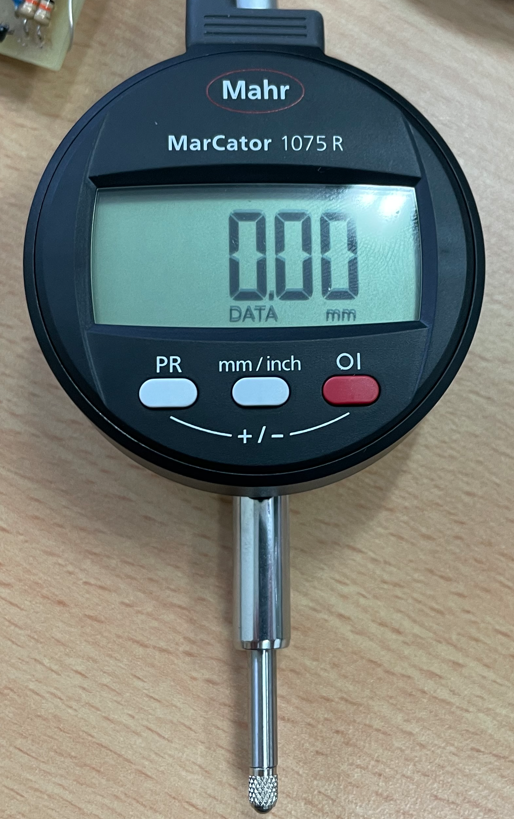 
## 1. Messaufbau:
### 1.1. MarCator **1075R** (Art.: 4336010, sn.: 22070356), 
### 1.2. Digimatic Kabel: Digimatic, Art No. 4102411
### 1.3. Messung/Empfänger: Saleae logic Pro 8
### 1.4. Signalkonditionierung: 3VDC an DATA, CLOCK und REQUEST
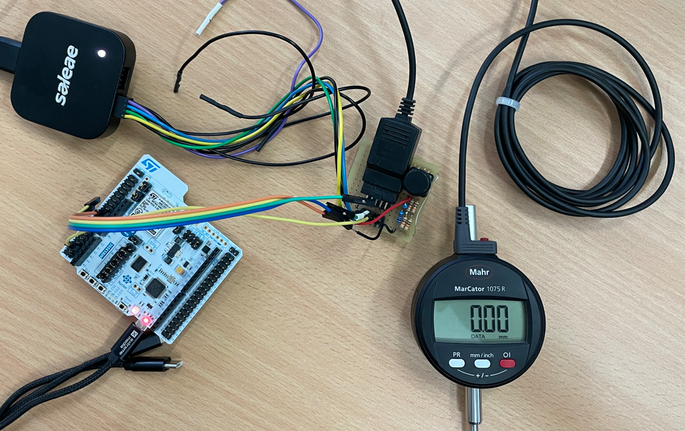 
  
## 2. Interface Beschreibung
***(Datenblatt: Ba_3723295_DK-U-D_de_en_fr_es_it_zh_0322-1.pdf):***
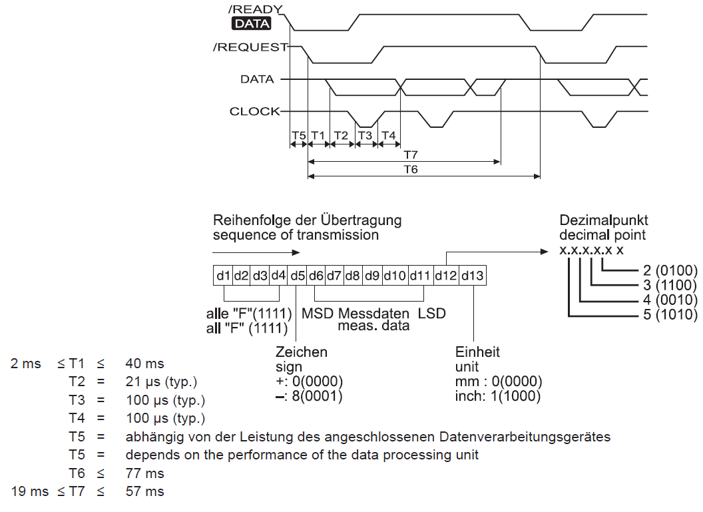
                   
## 3. Messungen:
### 3.1. Zeitaufnahme:
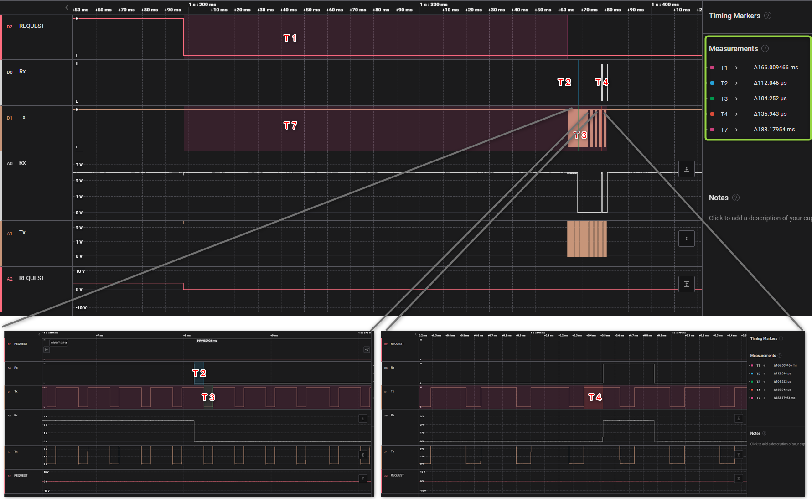
### 3.1. Zeitaufnahme mit Multi-Anforderung:
- 1000ms:
  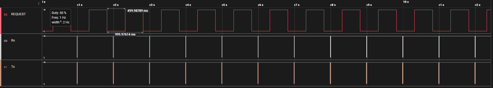
- 500ms
  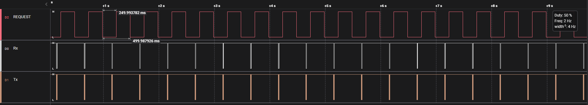
- 250ms:
  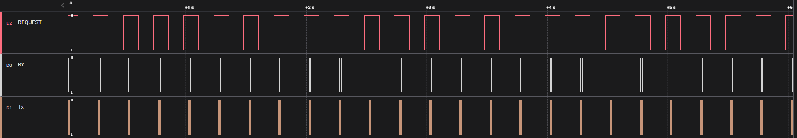
- 200ms:
  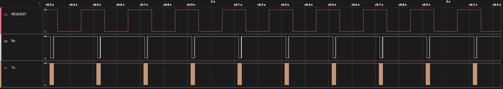
- 150ms (Antwortsperiode: 150ms):
  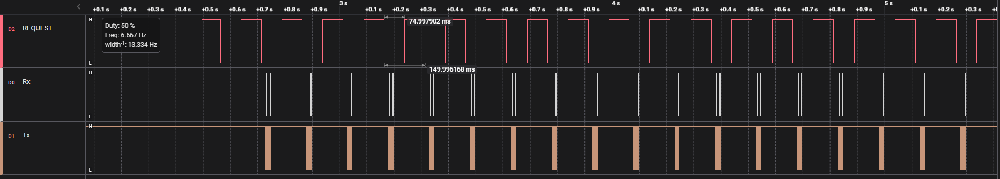
  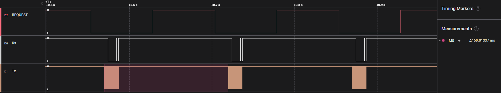
- 120ms (Antwortsperiode: 240ms):
  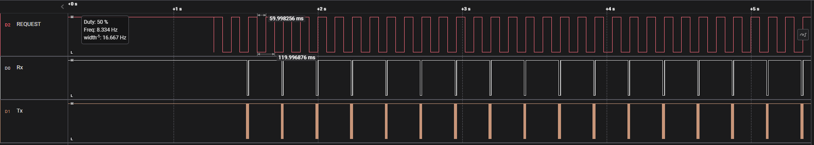
  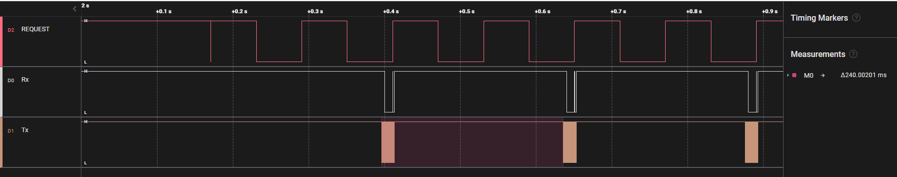
## 4. Ergebnis:
|Zeit|Typ|Min|Max|Ist|
|:-:|:-:|:-:|:-:|:-:|
|T1|-|2 ms|40 ms|166 ms|
|T2|21 us|-|-|112 us|
|T3|100 us|-|-|104 us|
|T4|100 us|-|-|136 us|
|T6|-|-|77 ms| 150 ms|
|T7|-|19 ms|57 ms|183 ms|
Datei sind plausiebel.
Antwortzeit für Tastendruck ist auch ohne Verzögerung.