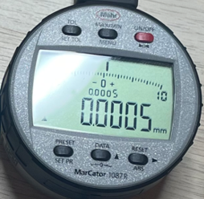
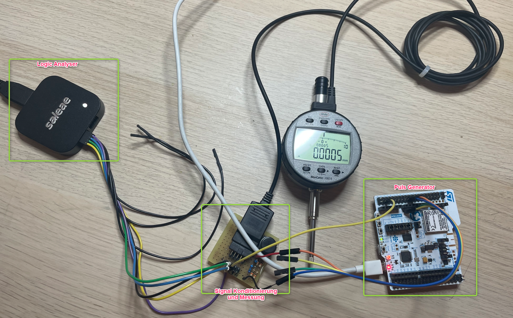

# MarCator 108x Digimatic schnittstelle prüfung

 
## 1. Messaufbau:
### 1.1. MarCator **1087R** (Art.: 4337665, sn.: 22050001), **1087BR** (Art.: 4337662, sn.: 22060031), **1086R** (Art.: 4337625, sn.: 22070042), **1086R** (Art.: 4337697, sn.: 22020002)
### 1.2. Digimatic Kabel: Digimatic, Art No. 4102411
### 1.3. Messung/Empfänger: Saleae logic Pro 8
### 1.4. Signalkonditionierung: 3VDC an DATA, CLOCK und REQUEST
  

 

## 2. Interface Beschreibung
***(Datenblatt: Ba_3723295_DK-U-D_de_en_fr_es_it_zh_0322-1.pdf):*** 

 

## 3. Messungen:
### 3.1. Einzelmessung:
   
### 3.1. Zyklischeanforderung:
- 1000ms
  
- 800ms
  
- 600ms
  
- 400ms
  
- 200ms
  
- 150ms
  
  
- 100ms
  
 
## 4. Ergebnis:
Alle Zeiten in toleranzen, T6 ist manuel betätigt.
|Zeit|Typ|Min|Max|Ist|
|:-:|:-:|:-:|:-:|:-:|
|T1|-|2 ms|40 ms|165 ms|
|T2|21 us|-|-|112 us|
|T3|100 us|-|-|105 us|
|T4|100 us|-|-|119 us|
|T6|-|-|77 ms| 150 ms*)|
|T7|-|19 ms|57 ms| 181 ms|
*) Wenn Zyklisch Gefragt. Zeit ist kürzer als bei Enzelanfrage.  
- Gesendete Datei sind plausibel.
- Zyklisch Anforderung bis 150ms stabil, keiene Datei ist verloren.
- Bei schnellere zyklische Aforderung z.B. 150ms, ist keine Antwort mehr:
  

- Anderes Efekt: CLOCK Frequenz ändert sich bisschen im Nachricht:
  