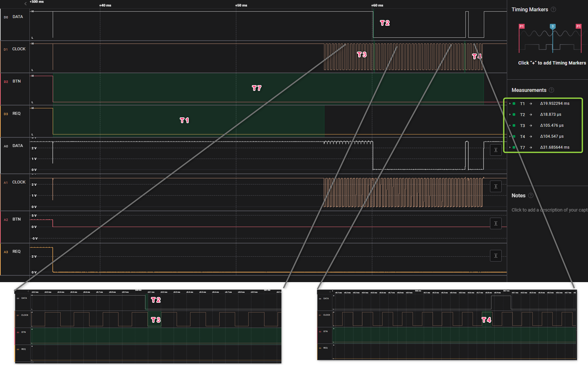
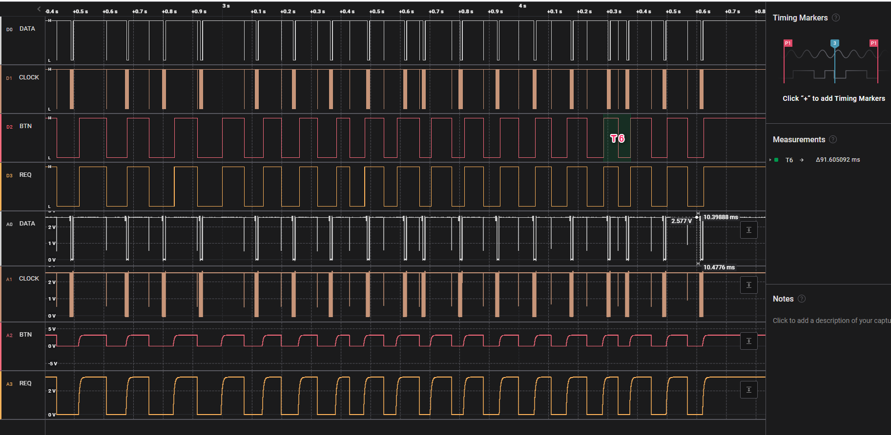

# MarCator digimatic schnittstelle pruefung

## 1. Messaufbau:
### 1.1. MarcaTor Prototyp
### 1.2. Digimatic Kabel: DK-D1
### 1.3. Messung/Empfänger: Saleae logic Pro 8
### 1.4. Signalkonditionierung: 3VDC an DATA, CLOCK und REQUEST

  
## 2. Interface Beschreibung
***(Datenblatt: Ba_3723295_DK-U-D_de_en_fr_es_it_zh_0322-1.pdf):***

                      
## 3. Messungen:
### 3.1. Zeitaufnahme:

### 3.1. Zeitaufnahme mit Multi-Anforderung:

  
## 4. Ergebnis:
Alle Zeiten in toleranzen, T6 ist manuel betaetigt.
|Zeit|Typ|Min|Max|Ist|
|:-:|:-:|:-:|:-:|:-:|
|T1|-|2 ms|40 ms|20 ms|
|T2|21 us|-|-|18.9 us|
|T3|100 us|-|-|105,5 us|
|T4|100 us|-|-|104,5 us|
|T6|-|-|77 ms| < 90 ms|
|T7|-|19 ms|57 ms|31,7 ms|

Sonst datei sind plausiebel.
Antwortzeit für Tastendruck ist auch ohne Verzögerung.