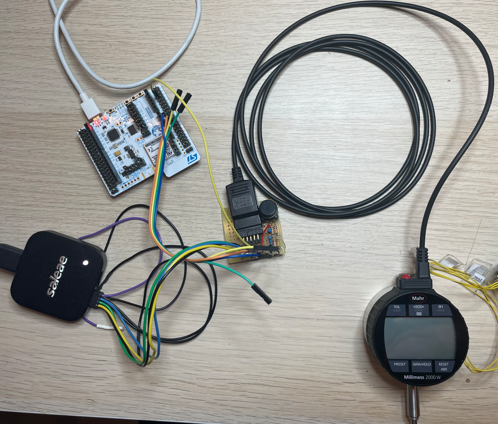
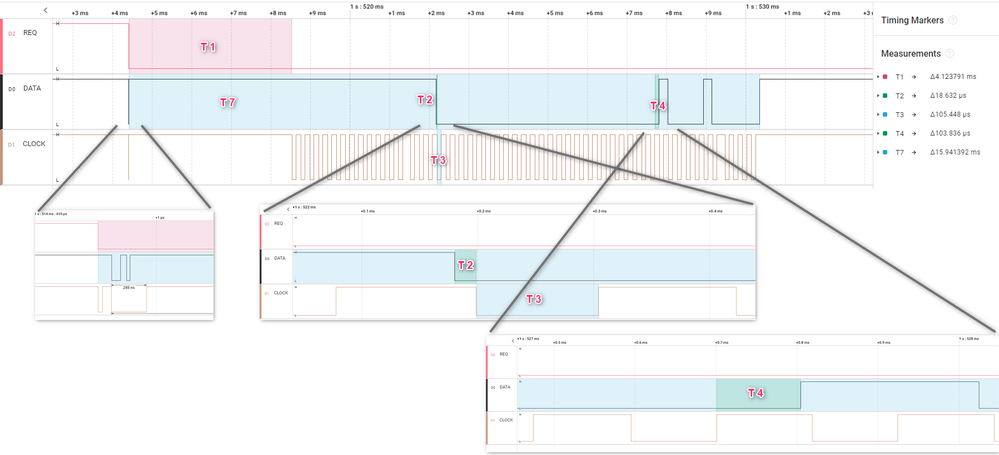
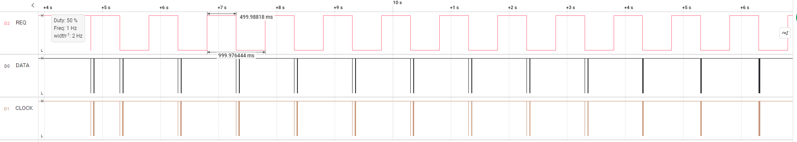
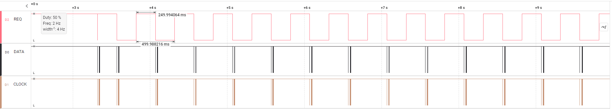
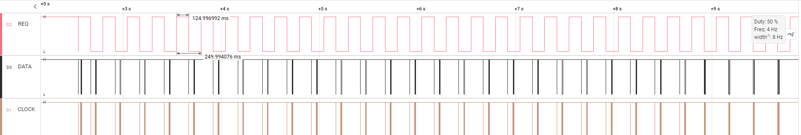
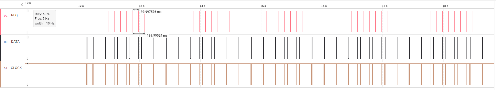
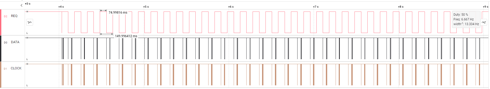
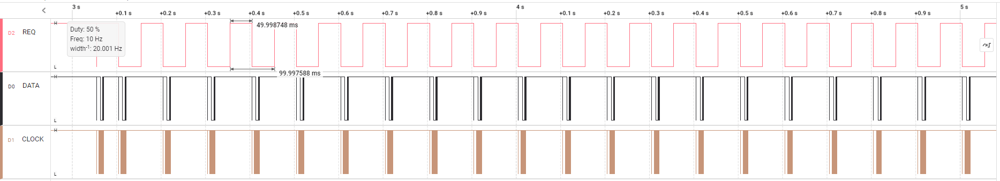
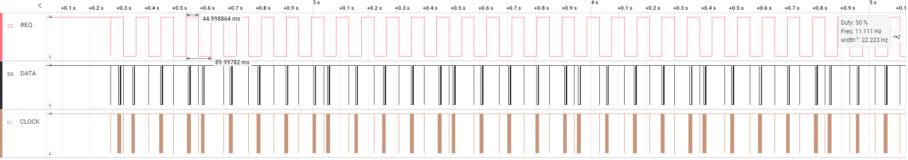
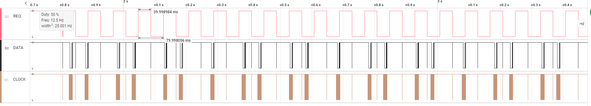

# Millimess 2000W digimatic schnittstelle pruefung
 
## 1. Messaufbau:
### 1.1. Millimess **2000W** Entwicklungsmuster
### 1.2. Digimatic Kabel: DK-D1, Art.: 4102606
### 1.3. Messung/Empfänger: Saleae logic Pro 8
### 1.4. Signalkonditionierung: 3VDC an DATA, CLOCK und REQUEST
 
  
## 2. Interface Beschreibung
***(Datenblatt: Ba_3723295_DK-U-D_de_en_fr_es_it_zh_0322-1.pdf):***

 

## 3. Messungen:
### 3.1. Zeitaufnahme:

### 3.1. Zeitaufnahme mit Zycklische-Anforderung:
- 1000ms:
  
- 500ms
  
- 250ms:
  
- 200ms:
  
- 150ms:
  
- 100ms:
  
- 90ms:
  
- 80ms:
  

## 4. Ergebnis:
|Zeit|Typ|Min|Max|Ist|
|:-:|:-:|:-:|:-:|:-:|
|T1|-|2 ms|40 ms|4 ms|
|T2|21 us|-|-|19 us|
|T3|100 us|-|-|106 us|
|T4|100 us|-|-|104 us|
|T6|-|-|77 ms| 100 ms|
|T7|-|19 ms|57 ms|16 ms|
