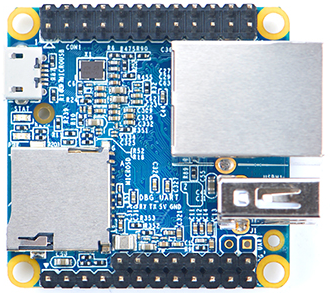

- frendly elec:
	vor: klein, billig, mit geheuse, 
	gegen: 
	- [nanopi NEO-LTS](https://www.friendlyelec.com/index.php?route=product/product&path=69&product_id=132) 
	- optionales [display](https://www.friendlyelec.com/index.php?route=product/product&product_id=191) 
	- [nanopi mit display und metal gehause](https://www.friendlyelec.com/index.php?route=product/product&product_id=190) 
- raspberry pi:
	- [model 3B](https://www.raspberrypi.com/products/raspberry-pi-3-model-b/)
	- [zero WiFi](https://www.raspberrypi.com/products/raspberry-pi-zero-2-w/)
- onion omega 2:
	vor: kleineste, einbau möglichkeit als ferige Modulen, billig, grosse Verfügbarkeit ( [OM-O2P](https://www.mouser.pl/ProductDetail/Onion/OM-O2P?qs=j%252B1pi9TdxUZwq9NawX9MnA%3D%3D) [OM-O2SP](https://www.mouser.pl/ProductDetail/Onion/OM-O2P?qs=j%252B1pi9TdxUZwq9NawX9MnA%3D%3D))
	gegen: keine gehuse, eingene pcb nötig
	- [module](https://onion.io/store/omega2/)
	- [mini dock](https://onion.io/store/mini-dock/)

|#|photo|name|descr|link|
|-|-|-|-|-|
|1||NEO LTS|von selbem Hersteller wie NEO3, klein, guenstig, mit Geheuse |[nanopi NEO-LTS](https://www.friendlyelec.com/index.php?route=product/product&path=69&product_id=132)|
|-||NEO Dispaly|vor:|[display](https://www.friendlyelec.com/index.php?route=product/product&product_id=191)|
|-|![[Pasted image 20221103154938.png]]|NEO LTS + Display + Metal Gehause||[nanopi mit display und metal gehause](https://www.friendlyelec.com/index.php?route=product/product&product_id=190)|
|1|![[rpi3bp.png]]|Raspberry Pi ||[raspberry Pi 3, Model B+](https://www.raspberrypi.com/products/raspberry-pi-3-model-b/)|
|-||Raspberry pi with Metal housing||[Metallgehäuse Raspberry Pi 3 - schwarz](https://de.farnell.com/gothenburg-designs/110218b/metal-case-for-raspberry-pi-3/dp/3404375?ost=110218b)|
|2|| Raspberry pi zero W | |[raspberry pi zero w]([Raspberry Pi Zero 2 W – Raspberry Pi](https://www.raspberrypi.com/products/raspberry-pi-zero-2-w/))|
|3||Omega Onion||[Omega2 – Onion](https://onion.io/store/omega2/) |
|-||Omega Onion||[Mini Dock – Onion](https://onion.io/store/mini-dock/) |
|-||Omega Onion|Sehr klein (34x20x2.8mm) und billig, pcb und gehause entwicklung noetig|[Omega2S – Onion](https://onion.io/omega2s/) |
|4||x86 SBC|||
|5||industrial computers, robust ||
|- ||industrial computers - DIN-rail mount|||
|-||industrial computers, custom design|||

