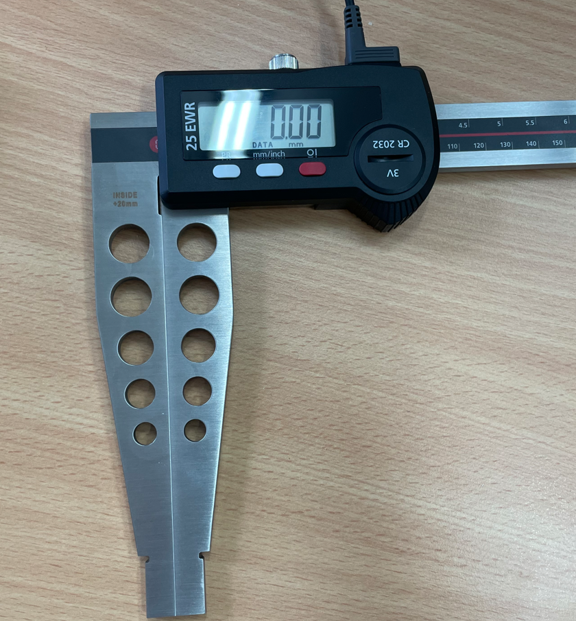
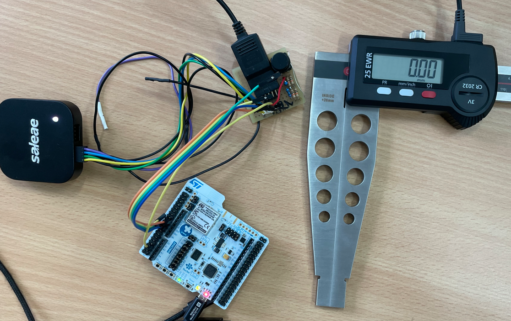
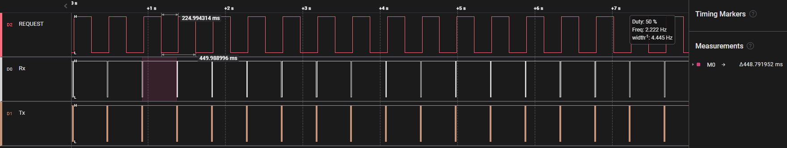
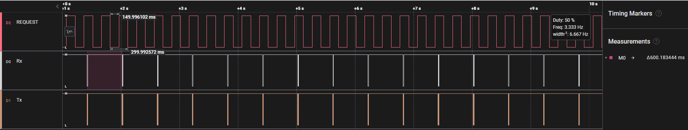

[HOME](../Deckblatt_Digimatic_analyse.md)<--->[PDF](25EWR_Digimatic_analyse.pdf)
# 25EWR digimatic schnittstelle Analyse
 
## 1. Messaufbau:
### 1.1. **18EWR/E** 500mm (Art.: 4112713, sn.: 12040130), 
### 1.2. Digimatic Kabel: Digimatic, Art No. 4102411
### 1.3. Messung/Empfänger: Saleae logic Pro 8
### 1.4. Signalkonditionierung: 3VDC an DATA, CLOCK und REQUEST
 

 

## 2. Interface Beschreibung
***(Datenblatt: Ba_3723295_DK-U-D_de_en_fr_es_it_zh_0322-1.pdf):*** 

 

## 3. Messungen:
### 3.1. Zeitaufnahme:

### 3.2. Zeitaufnahme mit Multi-Anforderung:
- 1000ms:
  
- 500ms
  
- 450ms
  
- 400ms
  
- 300ms
  
- 250ms:
  
- 200ms:
  

## 4. Ergebnis:
| Zeit  |  Typ   |  Min  |  Max  |  Ist   |
| :---: | :----: | :---: | :---: | :----: |
|  T1   |   -    | 2 ms  | 40 ms | 200 ms |
|  T2   | 21 µs  |   -   |   -   | 112 µs |
|  T3   | 100 µs |   -   |   -   | 104 µs |
|  T4   | 100 µs |   -   |   -   | 136 µs |
|  T6   |   -    |   -   | 77 ms | 450 ms |
|  T7   |   -    | 19 ms | 57 ms | 216 ms |
Datei sind plausiebel.