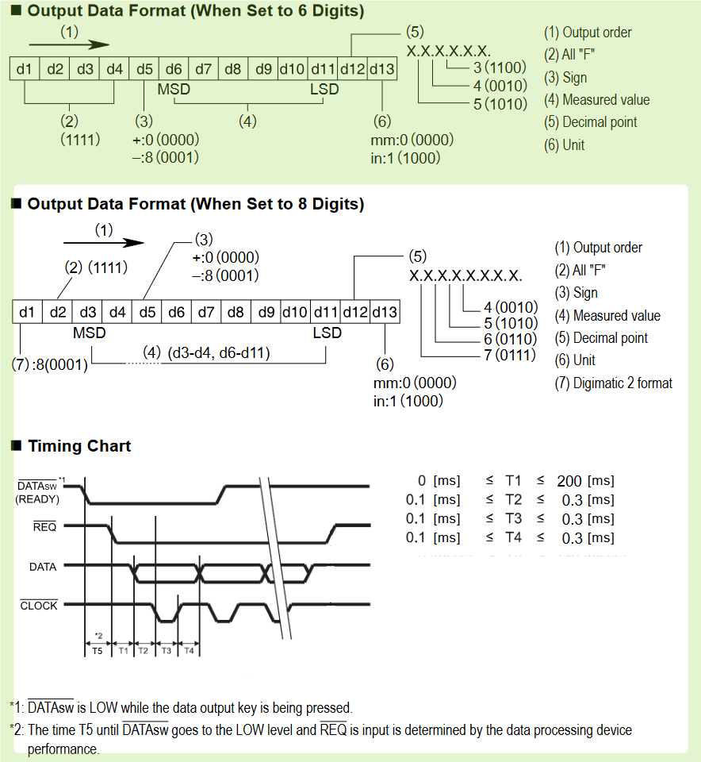

# Digimatic Schnittstelle analyse für Handmessgeräte

Datum: **29.12.2022** 
Schnittstelle: **Digimatic** 
Interface: **kabel DK-D1, Art No. 4102411, Art No. 4346021**  
kontakt: *Krzysztof Szczeciak (krzysztof.szczeciak@mahr.com)*

## 1. Getestete Geraete:
1. [Mikromar 40EWR](40EWR_Digimatic_analyse.html) 
2. [Micromar 40EWR-L](40EWR-L_Digimatic_analyse.html)
3. [25EWR (18EWR/E)](25EWR_Digimatic_analyse.html)
4. [MarCator 1075R](MC_1075R_Digimatic_analyse.html)
5. [MarCator 108x](MC_108x_Digimatic_analyse.html)
6. [MarCator Touch (Prototyp)](MarCator_Touch/MC_touch_Digimati_analyse.html)
7. [Millimess Touch 2000W](M2000W_Digimatic_analyse.html)
8. [Millimess Touch 2001W](M2001W_Digimatic_analyse.html)
9. [C1200](C1200_Digimatic_analyse.html)
10. [C1202](C1202_Digimatic_analyse.html)

## 2. Ergebnis, 6-stellige Digimatic Dateiübertragung
### 2.1. Definition
 

 

### 2.2. Tabelle
| **Geraet**                | Bild    | T1 [ms] | T2 [µs] | T3 [µs] | T4 [µs] | T6 [ms] | T7 [ms] | doku       |
| ------------------------- | ------- | ------- | ------- | ------- | ------- | ------- | ------- | ---------- |
| min                       |         | 2       | -       | -       | -       | -       | 19      |            |
| typ                       |         | -       | 21      | 100     | 100     | -       | -       |            |
| max                       |         | 40      | -       | -       | -       | 77      | 57      |            |
| **Micromar 40EWR**        | ![i][1] | 0,6     | 21      | 105     | 110     | 1200    | 13      | [doku][11] |
| **Micromar 40EWR-L**      | ![i][2] | 0,8     | 21      | 104     | 108     | 1200    | 13      | [doku][12] |
| **25EWR (18EWR/E)**       | ![i][3] | 200     | 112     | 104     | 136     | 450     | 216     | [doku][13] |
| **MarCator 1075R**        | ![i][4] | 166     | 112     | 104     | 136     | 150     | 183     | [doku][14] |
| **MarCator 108x**         | ![i][5] | 165     | 112     | 104     | 119     | 150     | 181     | [doku][15] |
| **MarCator Touch**        | ![i][6] | 20      | 19      | 106     | 105     | 90      | 32      | [doku][16] |
| **Millimess Touch 2000W** | ![i][7] | 4       | 19      | 106     | 104     | 100     | 16      | [doku][17] |
| **Millimess Touch 2001W** | ![i][8] | 10      | 19      | 106     | 104     | 100     | 22      | [doku][18] |
| **C1200**                 | ![i][9] | 35      | 71      | 105     | 97      | 70      | 49      | [doku][19] |

 

### 2.3. Diagramme

 

## 3. Digimatic 8-Stellige Dateiübertragung
### 3.1. Definition
 

 

### 3.2. Tabelle
| **Geraet** | img      | T1 [ms] | T2 [ms] | T3 [ms] | T4 [ms] | T6 [ms] | T7 [ms] | doku       |
| ---------- | -------- | ------- | ------- | ------- | ------- | ------- | ------- | ---------- |
| min        |          | 0       | 0,1     | 0,1     | 0,1     | -       | -       |            |
| typ        |          | -       | -       | -       | -       | -       | -       |            |
| max        |          | 200     | 0,3     | 0,3     | 0,3     | -       | -       |            |
| **C1202**  | ![i][10] | 0,005   | 0,006   | 0,07    | 0,06    | 10      | 7,4     | [doku][20] |
### 3.3. Diagramm

 

### 4. [Vergleich zum C1202 USB-schnittstelle](C1202_USB_analyse.md)

| **Geraet** |                         img                          | AnfragePeriode [ms] | doku       |
| ---------- | :--------------------------------------------------: | :-----------------: | ---------- |
| **C1202**  | ![i][10] +  |         100         | [doku][21] |

  
## 5. Ressourcen:
- [Digimatic 6- und 8- stellig Mitutoyo, 99MAB045A.pdf](_Docs_/Digimatic_analyse/res/99MAB045A.pdf)
- [Ba_3723295_DK-U-D_de_en_fr_es_it_zh_0322-1.pdf](_Docs_/Digimatic_analyse/res/Ba_3723295_DK-U-D_de_en_fr_es_it_zh_0322-1.pdf)
- [Excel-Tabelle mit Grafik](Digimatic_Tabelle.xlsx)
- [Dateipfad](./)

[1]: Micromar_40EWR/device_r.png
[2]: Micromar_40EWR-L/device_r.png
[3]: 25EWR/device_r.png
[4]: MarCator_1075R/device_r.png
[5]: MarCator_108x/device_r.png
[6]: MarCator_touch/device_r.png
[7]: Millimess_2000W/device_r.png
[8]: Millimess_2001W/device_r.png
[9]: Millimar_C1200/device_r.png
[10]: Millimar_C1202/device_r.png

[11]: ./Micromar_40EWR/40EWR_Digimatic_analyse.pdf
[12]: ./Micromar_40EWR-L/40EWR-L_Digimatic_analyse.pdf
[13]: ./25EWR/25EWR_Digimatic_analyse.pdf
[14]: ./MarCator_1075R/MC_1075R_Digimatic_analyse.pdf
[15]: ./MarCator_108x/MC_108x_Digimatic_analyse.pdf
[16]: ./Marcator_touch/MC_touch_Digimatic_analyse.pdf
[17]: ./Millimess_2000W/M2000W_Digimatic_analyse.pdf
[18]: ./Millimess_2001W/M2001W_Digimatic_analyse.pdf
[19]: ./Millimar_C1200/C1200_Digimatic_analyse.pdf
[20]: ./Millimar_C1202/C1202_Digimatic_analyse.pdf
[21]: ./Millimar_C1202_USB/C1202_USB_analyse.pdf