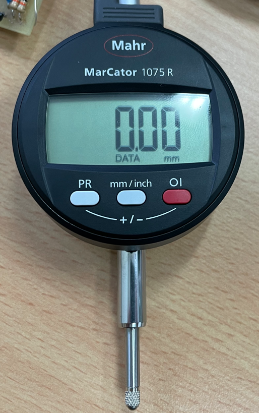
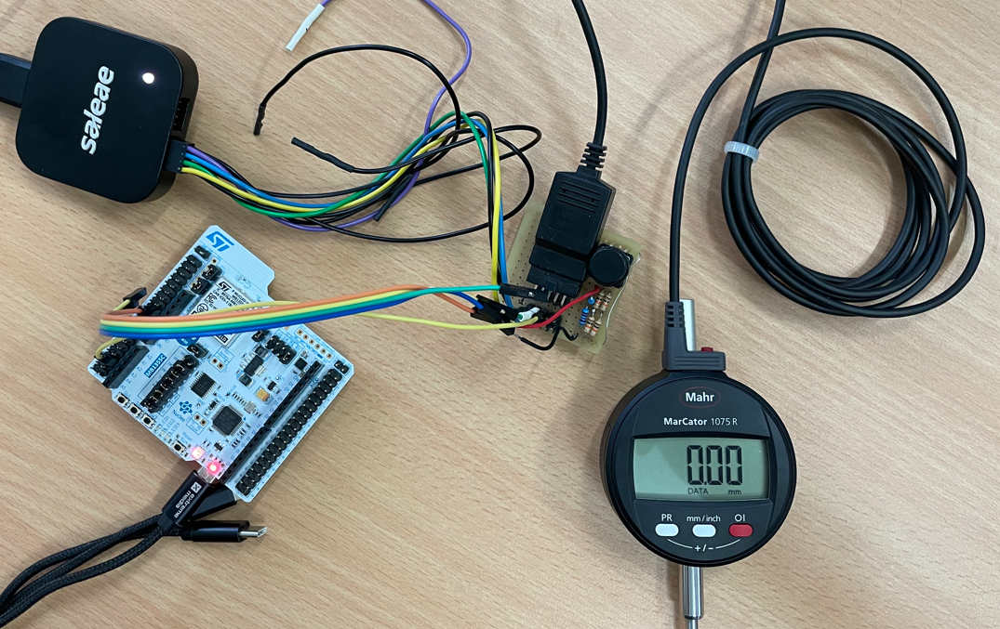
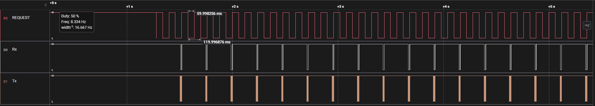
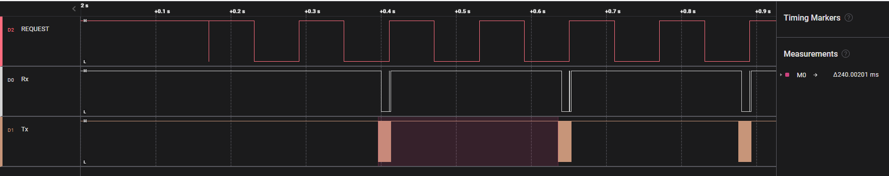

[HOME](../Deckblatt_Digimatic_analyse.md)<--->[PDF](MC_1075R_Digimatic_analyse.pdf)
# MarCator 1075R digimatic schnittstelle Analyse
 
## 1. Messaufbau:
### 1.1. MarCator **1075R** (Art.: 4336010, sn.: 22070356), 
### 1.2. Digimatic Kabel: Digimatic, Art No. 4102411
### 1.3. Messung/Empfänger: Saleae logic Pro 8
### 1.4. Signalkonditionierung: 3VDC an DATA, CLOCK und REQUEST

## 2. Interface Beschreibung
***(Datenblatt: Ba_3723295_DK-U-D_de_en_fr_es_it_zh_0322-1.pdf):*** 

## 3. Messungen:
### 3.1. Zeitaufnahme:

### 3.2. Zeitaufnahme mit Multi-Anforderung:
- 1000ms:
  
- 500ms
  
- 250ms:
  
- 200ms:
  
- 150ms (Antwortsperiode: 150ms):
  
  
- 120ms (Antwortsperiode: 240ms):
  
  
## 4. Ergebnis:
| Zeit  |  Typ   |  Min  |  Max  |  Ist   |
| :---: | :----: | :---: | :---: | :----: |
|  T1   |   -    | 2 ms  | 40 ms | 166 ms |
|  T2   | 21 µs  |   -   |   -   | 112 µs |
|  T3   | 100 µs |   -   |   -   | 104 µs |
|  T4   | 100 µs |   -   |   -   | 136 µs |
|  T6   |   -    |   -   | 77 ms | 150 ms |
|  T7   |   -    | 19 ms | 57 ms | 183 ms |

Datei sind plausiebel.
Antwortzeit für Tastendruck ist auch ohne Verzögerung.