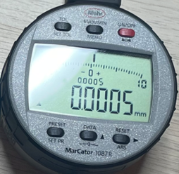
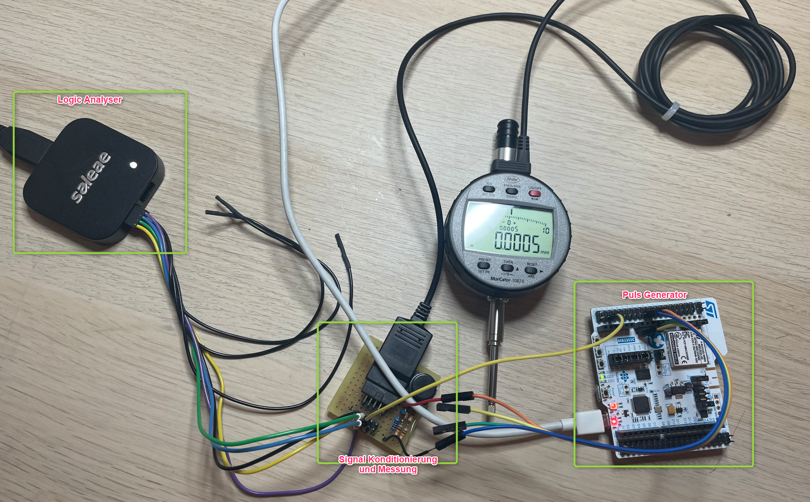
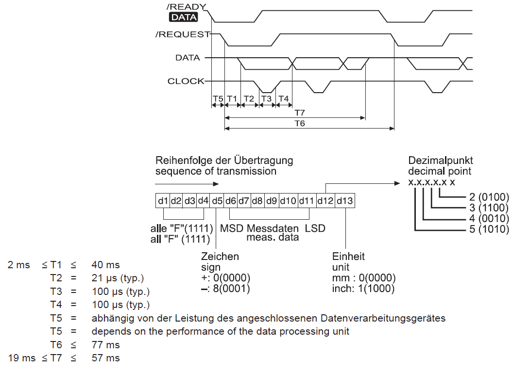
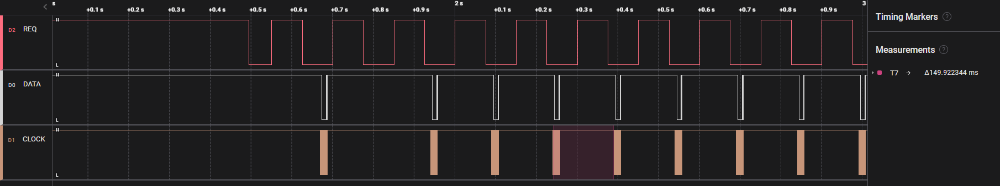
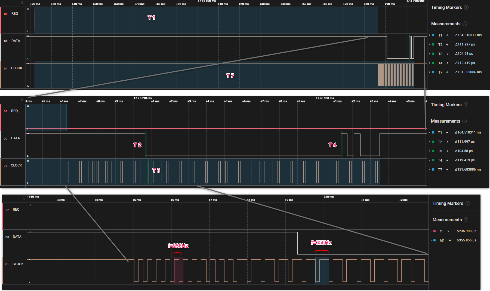

[HOME](../Deckblatt_Digimatic_analyse.md)<--->[PDF](MC_108x_Digimatic_analyse.pdf)
# MarCator 108x Digimatic schnittstelle Analyse
 

## 1. Messaufbau:
### 1.1. MarCator **1087R** (Art.: 4337665, sn.: 22050001), **1087BR** (Art.: 4337662, sn.: 22060031), **1086R** (Art.: 4337625, sn.: 22070042), **1086R** (Art.: 4337697, sn.: 22020002)
### 1.2. Digimatic Kabel: Digimatic, Art No. 4102411
### 1.3. Messung/Empfänger: Saleae logic Pro 8
### 1.4. Signalkonditionierung: 3VDC an DATA, CLOCK und REQUEST

 

## 2. Interface Beschreibung
***(Datenblatt: Ba_3723295_DK-U-D_de_en_fr_es_it_zh_0322-1.pdf):*** 

 

## 3. Messungen:
### 3.1. Einzelmessung:
 
### 3.2. Zyklischeanforderung:
- 1000ms
  
- 800ms
  
- 600ms
  
- 400ms
  
- 200ms
  
- 150ms
  
  
- 100ms
  
 
## 4. Ergebnis:
Alle Zeiten in toleranzen, T6 ist manuel betätigt.
| Zeit  |  Typ   |  Min  |  Max  |   Ist    |
| :---: | :----: | :---: | :---: | :------: |
|  T1   |   -    | 2 ms  | 40 ms |  165 ms  |
|  T2   | 21 µs  |   -   |   -   |  112 µs  |
|  T3   | 100 µs |   -   |   -   |  105 µs  |
|  T4   | 100 µs |   -   |   -   |  119 µs  |
|  T6   |   -    |   -   | 77 ms | 150 ms*) |
|  T7   |   -    | 19 ms | 57 ms |  181 ms  |

*) Wenn Zyklisch Gefragt. Zeit ist kürzer als bei Enzelanfrage.  
- Gesendete Datei sind plausibel.
- Zyklisch Anforderung bis 150ms stabil, keiene Datei ist verloren.
- Bei schnellere zyklische Aforderung z.B. 150ms, ist keine Antwort mehr:
  

- Anderes Efekt: CLOCK Frequenz ändert sich bisschen im Nachricht:
  