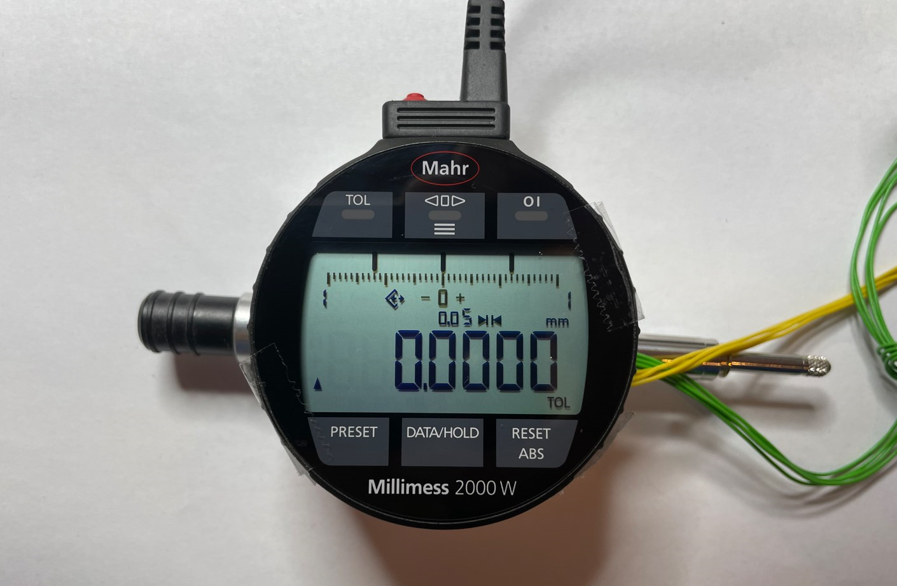
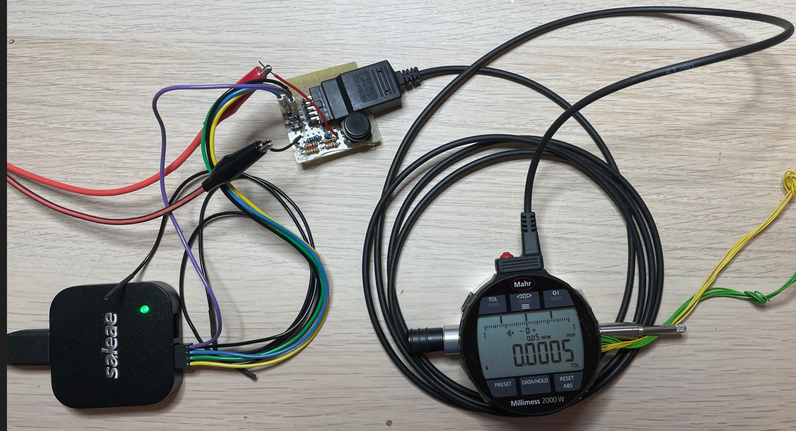
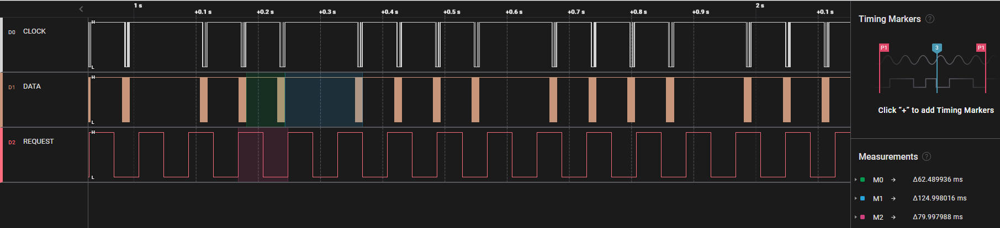
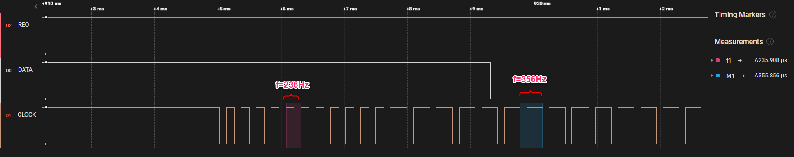

[HOME](../Deckblatt_Digimatic_analyse.md)<--->[PDF](MC_touch_Digimatic_analyse.pdf)
# MarCator Touch digimatic schnittstelle Analyze
 
## 1. Messaufbau:
### 1.1. MarCator Prototyp
### 1.2. Digimatic Kabel: DK-D1
### 1.3. Messung/Empfänger: Saleae logic Pro 8
### 1.4. Signalkonditionierung: 3VDC an DATA, CLOCK und REQUEST

 

## 2. Interface Beschreibung
***(Datenblatt: Ba_3723295_DK-U-D_de_en_fr_es_it_zh_0322-1.pdf):*** 

 

## 3. Messungen:
### 3.1. Zeitaufnahme:

### 3.2. Zeitaufnahme mit Mehrfache Anforderung:

- Requesttakt: 100ms

- Requesttakt: 80ms

- Requesttakt: 80ms Zoom

## 4. Ergebnis:
Alle Zeiten in toleranzen, T6 ist manuel betätigt.
| Zeit  |  Typ   |  Min  |  Max  |   Ist    |
| :---: | :----: | :---: | :---: | :------: |
|  T1   |   -    | 2 ms  | 40 ms |  20 ms   |
|  T2   | 21 µs  |   -   |   -   | 18.9 µs  |
|  T3   | 100 µs |   -   |   -   | 105,5 µs |
|  T4   | 100 µs |   -   |   -   | 104,5 µs |
|  T6   |   -    |   -   | 77 ms | < 90 ms  |
|  T7   |   -    | 19 ms | 57 ms | 31,7 ms  |

Alle datei sind plausiebel.
Antwortzeit für Tastendruck ist auch ohne Verzögerung.
Antwort Zeit kann ca 60ms sein aber <80ms Anforderungszeit ist nicht Stabil.
Variable Clock-Frequentz:
