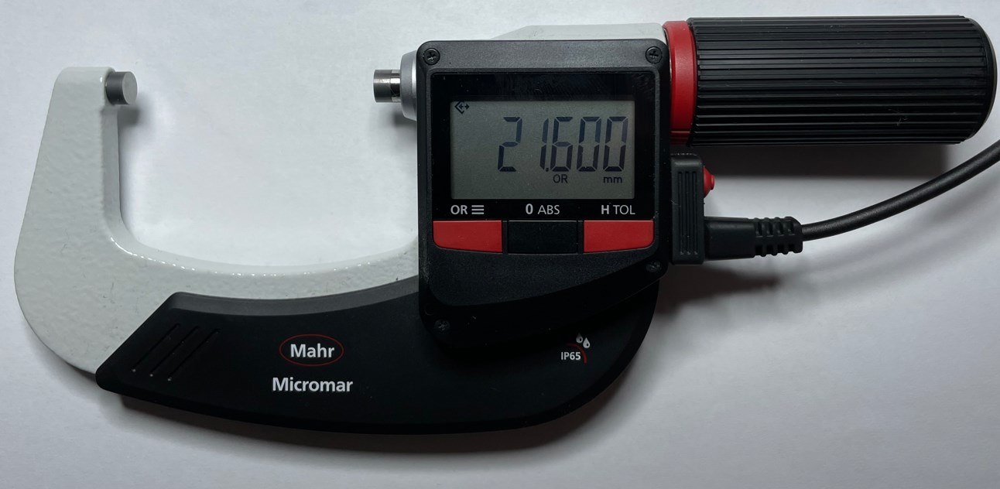
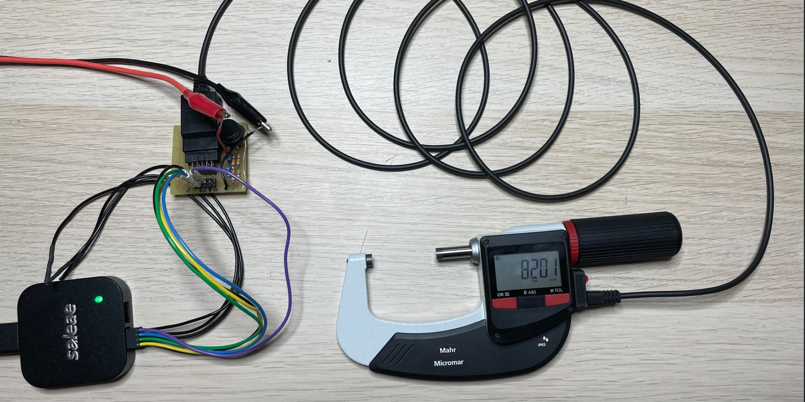
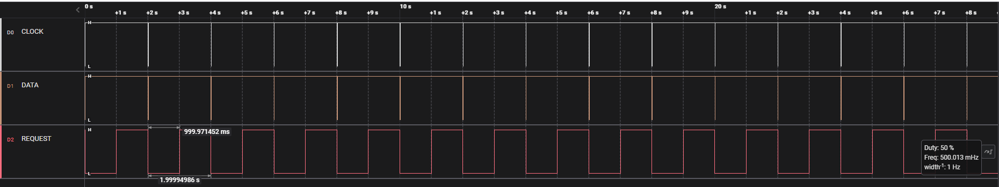
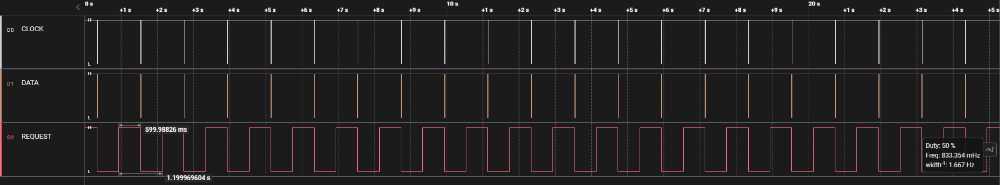
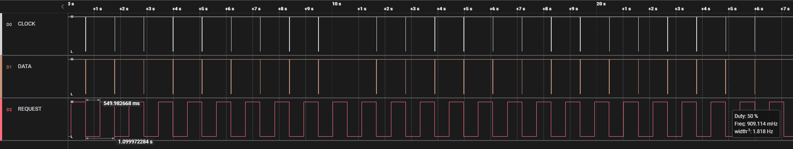
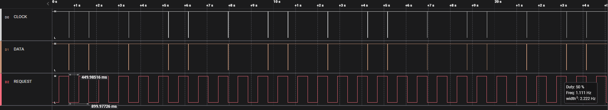
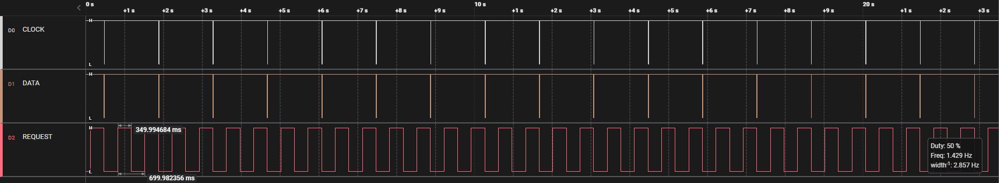
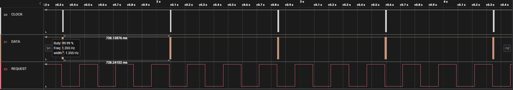
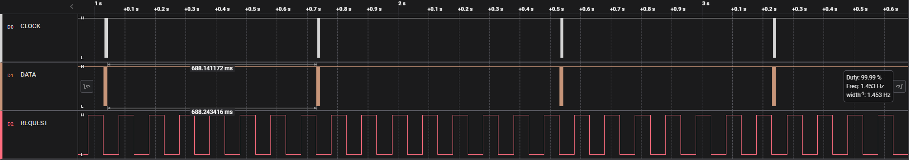

[HOME](../Deckblatt_Digimatic_analyse.md)<--->[PDF](40EWR-L_Digimatic_analyse.pdf)
# 40EWR-L digimatic schnittstelle Analyse
 
## 1. Messaufbau:
### 1.1. 40EWR-L, 25-50mm (art.: 4157021, sn.: 22100002)
### 1.2. Digimatic Kabel: DK-D1
### 1.3. Messung/Empfänger: Saleae logic Pro 8
### 1.4. Signalkonditionierung: 3VDC an DATA, CLOCK und REQUEST
 

 

## 2. Interface Beschreibung
***(Datenblatt: Ba_3723295_DK-U-D_de_en_fr_es_it_zh_0322-1.pdf):*** 

 

## 3. Messungen:
### 3.1. Zeitaufnahme:

### 3.2. Zeitaufnahme mit Zycklische-Anforderung:
- Digital und Analog:
    
- Requesttakt: 2000ms

- Requesttakt: 1200ms

- Requesttakt: 1100ms

- Requesttakt: 1000ms

- Requesttakt: 900ms

- Requesttakt: 800ms

- Requesttakt: 700ms

- Requesttakt: 600ms

- Requesttakt: 500ms

- Requesttakt: 250ms

- Requesttakt: 250ms Zoom

- Requesttakt: 150ms

- Requesttakt: 150ms Zoom

- Requesttakt: 100ms

- Requesttakt: 100ms Zoom

## 4. Ergebnis:
Zeiten T1, T6 und T7 sind auser Toleranz
| Zeit  |  Typ   |  Min  |  Max  |   Ist    |
| :---: | :----: | :---: | :---: | :------: |
|  T1   |   -    | 2 ms  | 40 ms |  0,8 ms  |
|  T2   | 21 µs  |   -   |   -   | 21,0 µs  |
|  T3   | 100 µs |   -   |   -   | 103,9 µs |
|  T4   | 100 µs |   -   |   -   | 107,9 µs |
|  T6   |   -    |   -   | 77 ms | 1200 ms  |
|  T7   |   -    | 19 ms | 57 ms | 12,8 ms  |

- 40EWR-L erst bei 1200ms stabil
- 40EWR-L, wenn Anforderungsrate ist schneller ( <250ms) antwort stabilisiert sich ca 700ms jede Antwort
- Sonst datei sind plausiebel.
- Antwortzeit für Tastendruck ist auch ohne Verzögerung.