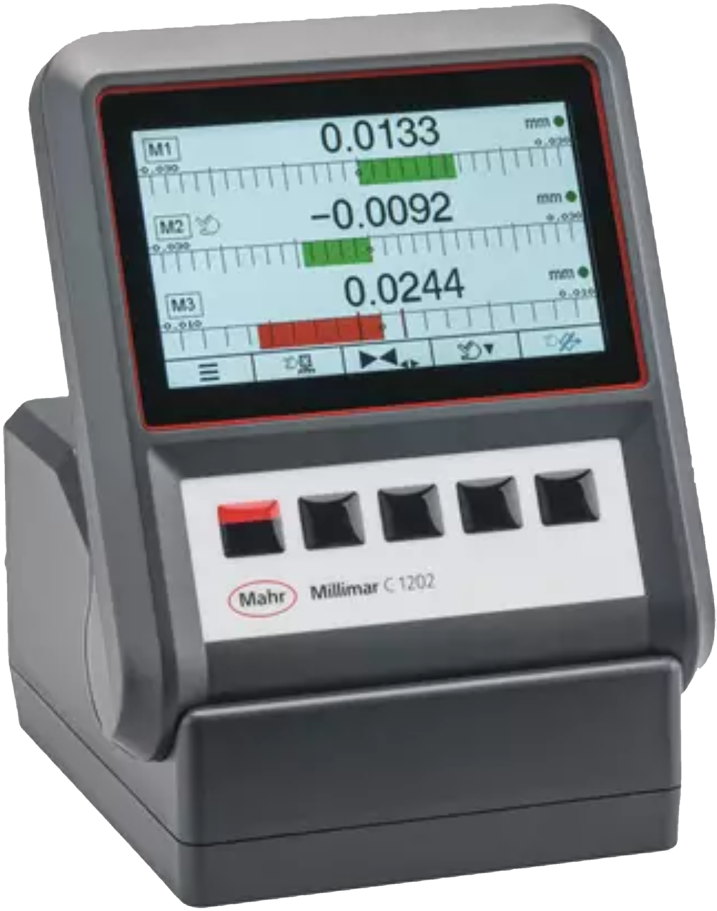
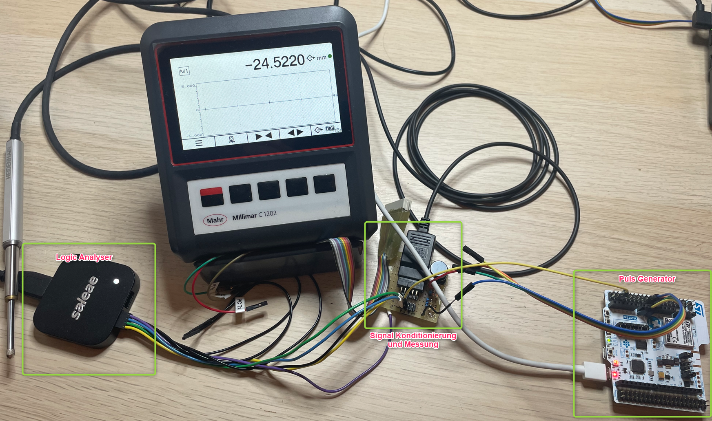
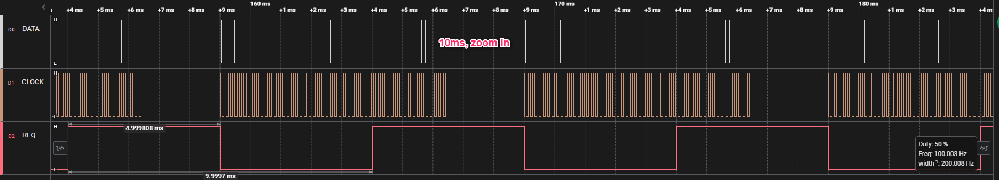
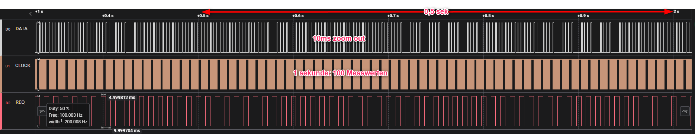
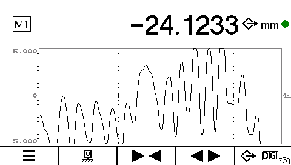

[HOME](../Deckblatt_Digimatic_analyse.md)<--->[PDF](C1202_Digimatic_analyse.pdf)
# C1202 Digimatic schnittstelle Analyse
 

## 1. Messaufbau:
### 1.1. C1202 mit FW 1.1.0.0 (Enwicklungsmuster), **Digimatic: 8-stellige Format implementiert**
### 1.2. Digimatic Kabel: DK-D1
### 1.3. Messung/Empfänger: Saleae logic Pro 8
### 1.4. Signalkonditionierung: 3VDC an DATA, CLOCK und REQUEST
 

 

## 2. Interface Beschreibung
***(Datenblatt: Mitutoyo Digimatic Micrometer Manual MDH-MB No. 99MAB045A: "99MAB045A.pdf"):*** 

 

## 3. Messungen:
### 3.1. Einzelmessung:

### 3.1. Zyklische-Anforderung:
- 1000ms
  
- 500ms
  
- 250ms
  
- 100ms
  
- 50ms
  
- 20ms
  
- 10ms
  
  Zoom in:
  
  

 

  Zoom out:
  
  
## 4. Ergebnis:
Alle Zeiten in toleranzen, T6 ist manuel betätigt.
| Zeit  |  Typ  |  Min   |  Max   |   Ist    |
| :---: | :---: | :----: | :----: | :------: |
|  T1   |   -   |  0 ms  | 200 ms |  52 us   |
|  T2   |   -   | 0,1 ms | 0,3 ms | 0,006 ms |
|  T3   |   -   | 0,1 ms | 0,3 ms | 0,070 ms |
|  T4   |   -   | 0,1 ms | 0,3 ms | 0,062 ms |
|  T6   |   -   |   -    |   -    |  <10 ms  |
|  T7   |   -   |   -    |   -    |  7,4 ms  |

Datei sind plausibel in jede bereich, im allen Zykluszeiten stabil bis 10ms! Keine Datei ist verloren.
Andere wirkungen: 
Bei 10ms, Anzeigebild an C1202 ist bisschen langsam, aber funktionier Vollständig und mit giltigen Datei: 
 
Bei 100ms Anzeigebild Influss ist gering.

Atwort Zeit ist konstant im allen bereichen.

