[HOME](../Deckblatt_Digimatic_analyse.md)<--->[PDF](C1202_USB_analyse.pdf)
# C1202 USB Datenanfrage Analyse
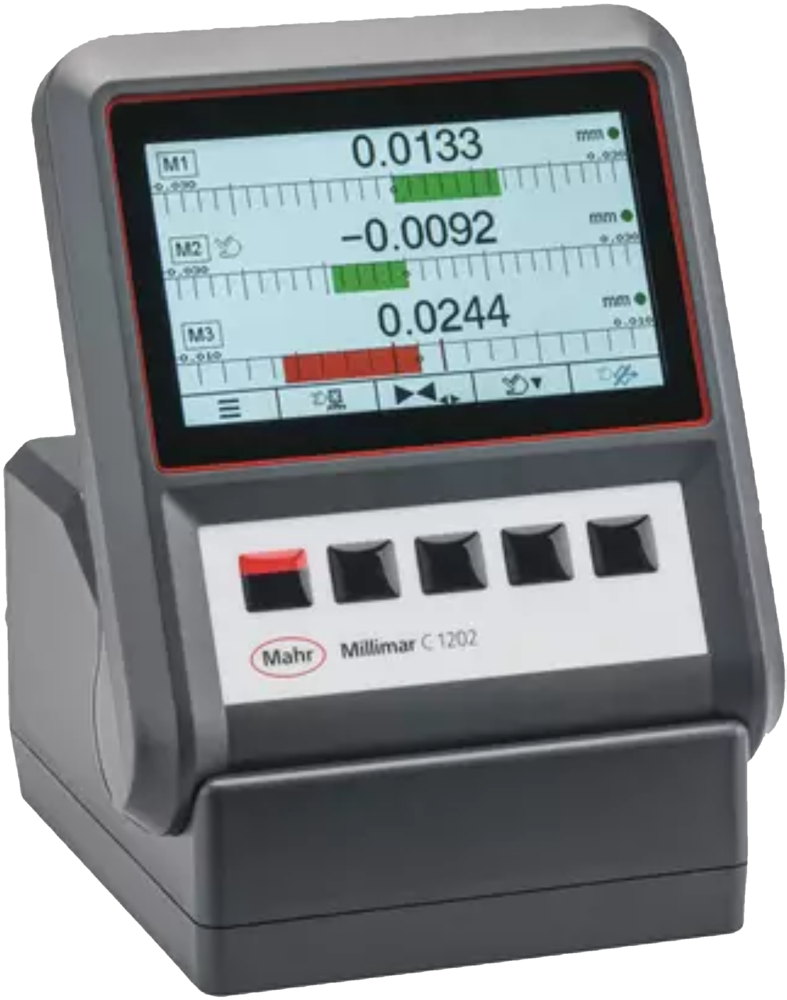<br>

## 1. Messaufbau:
### 1.1. C1202 mit FW 1.1.0.0
### 1.2. Digimatic Kabel: DK-U1 
### 1.3. Messung: Saleae logic Pro 8
### 1.4. Empfänger/Anförderung: PC06-451
## 2. Interface Beschreibung
- interfcae: 9600 7E2<br>
<a href="file://essfs01/Abteilungen/Benutzergruppen/Firmware_Software/Interface%20Beschreibung%20Datenkabel%20DK-U1/Release/20220926_DK-U1 Instruction%20Set.xlsm">20220926_DK-U1 Instruction Set.xlsm</a>
> **\\essfs01\Abteilungen\Benutzergruppen\Firmware_Software\Interface Beschreibung Datenkabel DK-U1\Release\20220926_DK-U1 Instruction Set.xlsm**
<div style="page-break-after: always;"></div><br>

## 3. Messungen:
### 3.1. Einzelantwort für '?':
- Anzahl Merkmale: 1, 2 oder 3
- Toleranz: Nein
- Warngrenzen: Nein
- Anforderung: Befehl ('?')
- Daten Senden: Parallel
- Gesamtzeit: 60ms 
  
<br><br><br>
### 3.2. Einzelantwort für 'M1?':
- Anzahl Merkmale: 1, 2 oder 3
- Toleranz: Nein
- Warngrenzen: Nein
- Anforderung: Befehl ('M1?')
- Daten Senden: Parallel
- Gesamtzeit: 40ms 
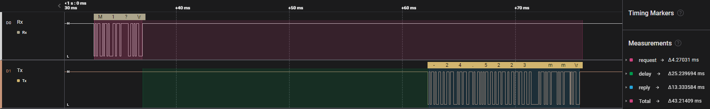
### 3.3. Zyklischeanforderung für alle Merkmale:
- 1000ms
  
- 500ms
  
- 200ms
  
- 100ms
  
- 80ms
  
- 50ms
  
  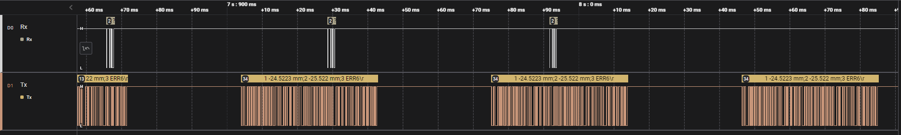
- 20ms
  
  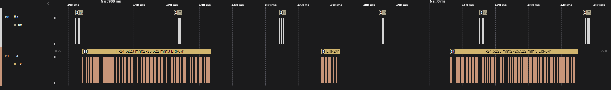
- 10ms
  
### 3.4. Zyklischeanforderung für Einzelmerkmal: ('M1')
- 200ms:
  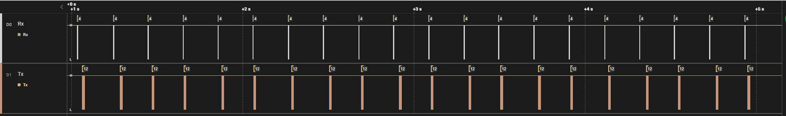
  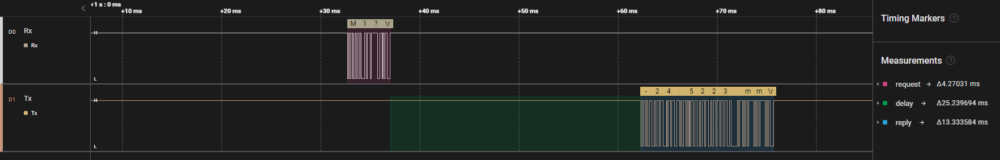
- 100ms:
  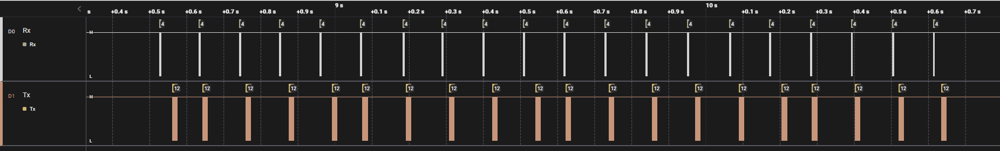
- 50ms:
  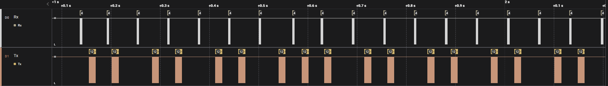
- 20ms:
  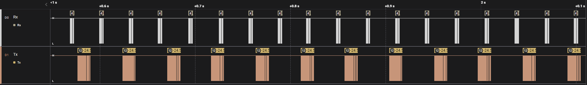
- 10ms:
  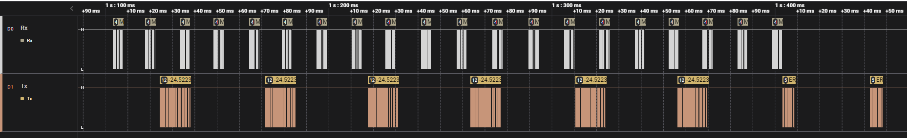
### 3.5. Automatische senden für Zeit gesteuerte Messung
- Schnellste Einstellung ist: 200ms (Messdauer=0,1 sek, Pausendauer=0,1 sek):
  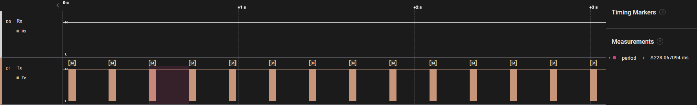
  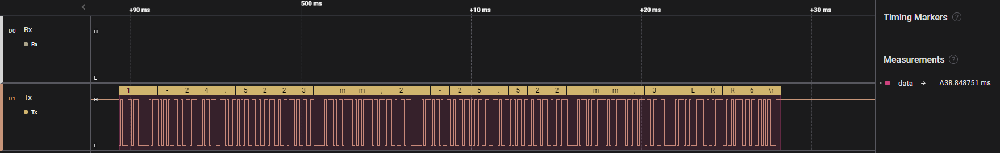
  Nachrichtlänge: ca. 40ms
## 4. Ergebnis:
- Ausgabewerte sind plausiebel mit aktuellem Werten.
- Limietireungsfaktor ist baud rate: 9600 bps
- Zeiten:
  - Kurze Anfrage ('?'): ca 2ms
  - Länge Anfrage ('Mx?'): ca 4ms
  - Antwort verzügerung: ca 20ms
  - Nachricht ca 15-40ms
  - Frage-Antwort: 40-60ms
  - Maxmimale Anforederungsrate: 100ms (10 Werte pro sekunde)
  <br><br><br><br>
## 5. Zeitverkürzungs möglichkeiten (Mehr Data Anfordern):
- Einzelwert Anfragen: 'Mx?'
- Baudrate erhühren, (Antwortzeit ca. 30ms)
- digimatic Schnittstelle nutzen
<div style="page-break-after: always;"></div><br>

## Source code for testing <br>
> Python / Jupyter Notebook
``` python
import serial
import time
import ipywidgets as widgets

dataReq = '?\r'.encode('ASCII')

ser = serial.Serial()
ser.baudrate = 9600
ser.port = 'COM5'
ser.bytesize = 7
ser.parity = 'E'
ser.stopbits = 2
ser.timeout = 0

def runtest(time_ms, request_qty):
    ser.open()
    print("start: " + str(time_ms/1000) + " s ...")
    for i in range(request_qty):
        ser.write(dataReq)
        time.sleep(time_ms/1000)
    print("finished")
    ser.close()
widgets.interact_manual(runtest, time_ms=widgets.FloatSlider(min=10, max=1000, step=10), request_qty=widgets.IntSlider(min=10, max=100, step=10));
```