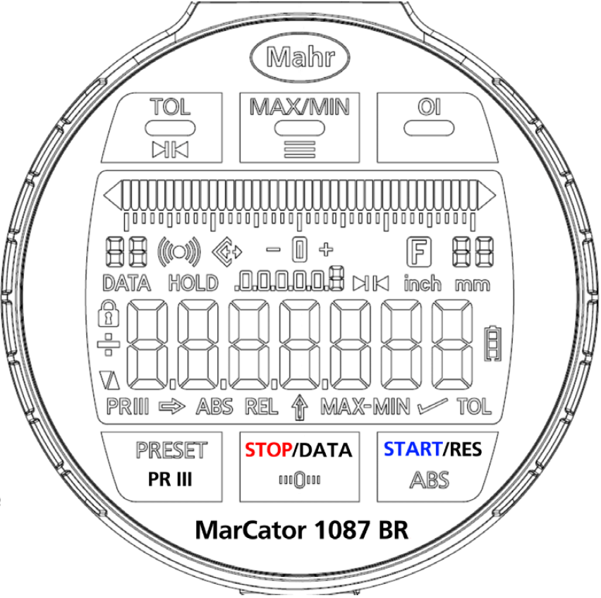
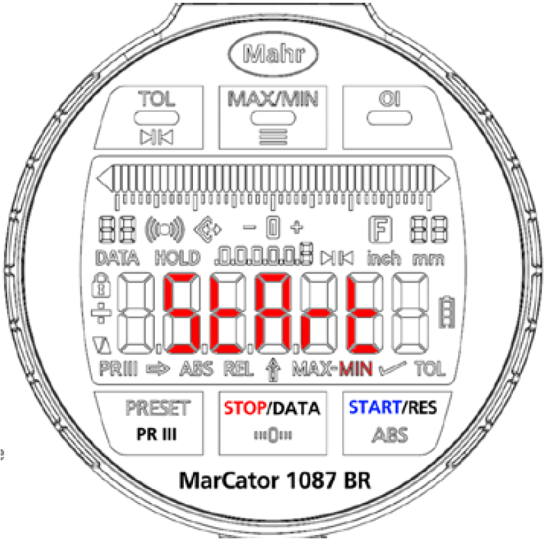

# Marcator Firmware 1087BR(i)

## Resources:
- [DK-U1 protokol](Docs/MarCom/DK-U1.md)
- [Funk protocol](Docs/funk/Mahr%20Funk-Protokoll%2044EWRi.docx)
- [Funk neu](neuFunkBefehl.md)
- [Low power optimization docs](./Docs/LPM_analyse/MarCator_LowPowerOpt.pdf)

## description:

- based on 1086R/1087R(i) firmware
- Designation: 
- diffs:
  - measurement normal
    - after selcting min or max with btn min/man: start should show "StArt"
    - after pressing start btn, "MIN" or "MAX" should blink,
    - pressing start btn in this state resets measurement
    - pressing stop btn will stop measurement and send data
    - display "DATA" for 0,5 sec
    - additional "HOLD" permanent
    - btn preset
  - measurement at work peace:
    - btn start, min or max blinking
    - as above in loop insead
    - ...
  - during measurement O btn and ABS is not activ (what is ABS?) - should dislp no funct

## Versions:

added:

- Dynamic Measurement:
  - new "Start" display
  - Only functions avaliable
  - Blink Functions: MIN, MAX, MAX-MIN
  - Switching Functions during measurement not possible ("no func" display when pressing), possible only when stopped
  - measurement stop message "StoP" displayed when stopping for 1 sec.
  - "HOLD" icon displayed when measurement not started
  - Value reset after Start
- Battery indicator mapped and displayed, no measurments yet

## changes 2023.03.22:
- Standard messung möglich
- "Start" Anzeige nur einmal
- State machine
- Wert reset am 
- Extreme funktionen nur MIN und MAX
- Toleranz in Min Max möglich:
  - skalierung dynamisch wechselbar
  - Toler umstellung für Standard messung und MIN MAX messung bleibt
  - Toleranzgrenze analoganzeige blinkt
- Baterieanzeige funktion fuer Messmodul verbunden
- Befehl Messrichtung geändert füt CHA+/-
- auschalten HOLD wenn DK-U1 ist angeschliesen
- Funkchip erkennung am start mit LED zeigen:
  - rot LED: kein Funk Chip gefunden
  - gelb LED: Funk Chip gefunden

noch zum machen:
- Data senden bei messung ende (mit toleranz)
- 64werte pro sekunde in messmodi
- time out in messmodi

fragen:
- Stop/Data taste soll auhc "Hold" funktion haben?
- Toleranz wechsel auch bei messung möglich?

[DK-U1 protocol documentation](\\essfs01\Abteilungen\Benutzergruppen\Firmware_Software\Interface Beschreibung Datenkabel DK-U1\Release)
<a href="\\essfs01\Abteilungen\Benutzergruppen\Firmware_Software\Interface Beschreibung Datenkabel DK-U1\Release">DK-U1 protocol</a>
